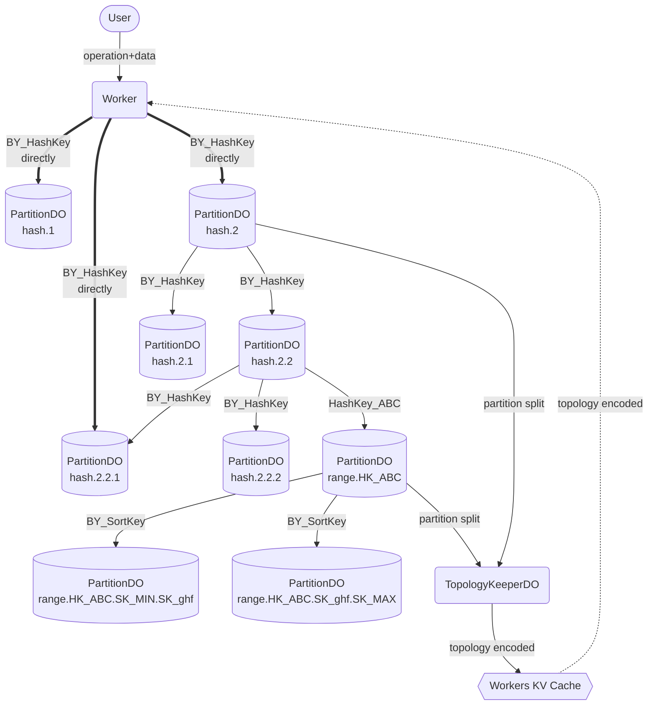
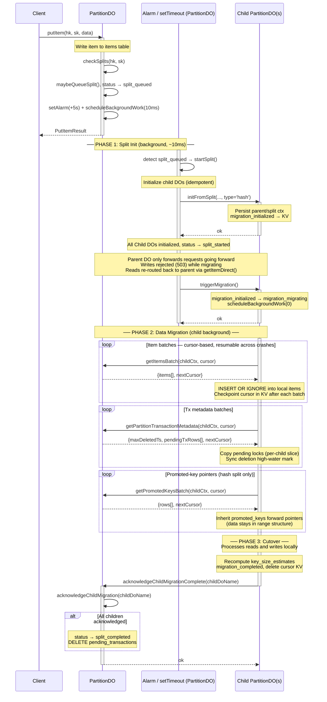
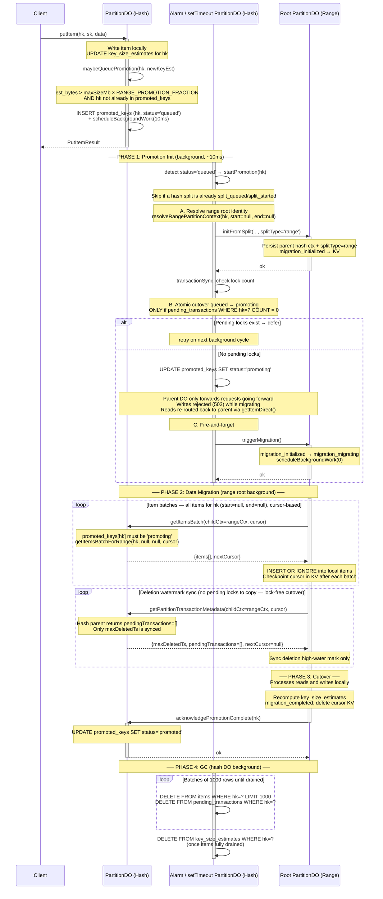

In this post I do a deep dive on a database I built ontop of [Cloudflare Durable Objects](https://developers.cloudflare.com/durable-objects/concepts/what-are-durable-objects/) (DOs) and the rest of [Cloudflare Developer Platform](https://developers.cloudflare.com/).

Let's clarify a few things first.

- Is FokosDB production ready? Not **yet**, but it will be soon.
- Is FokosDB going to be fast and suitable for all use-case? No, read the [Tenets](#tenets) and [Goals](#goals-and-api) sections below.
- Is FokosDB going to be enough for many applications on Cloudflare Workers? Absolutely.
- Is FokosDB really bottomless storage? Yes, as long as Durable Objects can be created in your account.
- Is FokosDB an official Cloudflare product? No, hence not officially supported by Cloudflare.

Is this yet another vibe-slop? No. I did a lot of iterations on the design, and researched a lot of similar databases before I settled on the following tenets and goals. A lot of the code is AI generated (see [AI productivity boost](#ai-productivity-boost) section) but I reviewed every single line, and most likely I modified every single line in some way or another.

Having said that, the code is still quite prototype-ish and I plan to refactor it, since the goal so far was to get a first version of the database working.

This article is written word by word by me. 😉

FokosDB is the database I want to use in production for my projects on Cloudflare's Developer Platform.

## Table of contents

- [Tenets](#tenets)
- [Goals and API](#goals-and-api)
- [Why not xyz](#why-not-xyz)
- [Platform constraints](#platform-constraints)
- [System architecture overview](#system-architecture-overview)
    - [Life of a FokosDB request](#life-of-a-fokosdb-request)
    - [Data partitions](#data-partitions)
    - [Topology invariants](#topology-invariants)
- [Splits and hash key promotions](#splits-and-hash-key-promotions)
    - [Hash key promotions](#hash-key-promotions)
- [Distributed transactions](#distributed-transactions)
- [Topology encoding and caching](#topology-encoding-and-caching)
    - [Related work](#related-work)
    - [FokosDB encoded topology](#fokosdb-encoded-topology)
- [Future work](#future-work)
    - [Performance optimizations](#performance-optimizations)
    - [Wishlist for the platform](#wishlist-for-the-platform)
- [Show me the numbers](#show-me-the-numbers)
- [AI productivity boost](#ai-productivity-boost)
- [Conclusion](#conclusion)

## Tenets

Applications, especially data products, deployed on serverless platforms have to make trade-offs due to the different constraints of the platform, and Cloudflare's Developer Platform is no different.

These tenets drive the trade-offs in the architecture and characteristics of the database.

- Bottomless storage.
    - Within practical limits I don't want to be constrained on the total overall storage used by the database. I should be able to store TBs of data without issues.
- Strong consistency.
    - Eventual consistency makes everything harder to reason about. If I update item A and immediately read item A, I want to see its latest version.
    - Eventual consistency could be optional if it gives significant performance benefits, but should be opt-in.
- Throughput should scale across different items.
    - Even if the per-item throughput will be constrained, throughput across thousands or millions of items should scale up linearly to the number of items.
- Good enough performance.
    - Network round-trips are inevitable when running at the edge and wanting to reach durable storage, but we should reduce them as much as possible.
    - Ballpark read item latency: same country less than 50ms, same region less than 200ms.
- Managed scaling.
    - Scaling should be automatic without manual intervention. Just write and read data.

## Goals and API

These goals drive the implementation and API provided.

- Each item is identified by a **hash key** and a **sort key**.
    - When items have the same hash key they should have different sort keys, and items having the same hash key are sorted alphabetically based on their sort key allowing range queries within the hash key.
- Each item is less than `1MB` (default limit is `500KB`). For larger blobs I will implement integration with R2 (object storage).
- Scalability is achieved by sharding across many different items, ideally with different hash keys to eliminate hot partitions as much as possible.
    - The system architecture optimizes for hash key sharding, even if you can have unlimited number of range keys within a hash key.
- Core operations: `putItem`, `getItem`, `deleteItem`, `queryItems` (soon).
    - All write operations support conditional checks.
- Distributed transactions across items: `transactWriteItems`, `transactReadItems`.
    - Restrictions on number of items and total request size apply.
- Trade-offs are based on these load profiles: a) 100-500 GB total storage, and b) 100 TB+ total storage, both assuming well spread out hash keys.

My [favourite database is Amazon DynamoDB](https://www.lambrospetrou.com/articles/dynamodb/) in case it wasn't clear so far.

## Why not xyz

Why did I build a new database instead of using something that already exists?

Cloudflare offers several storage products: D1, Durable Objects, Hyperdrive+Postgres/MySQL, R2, Workers KV

Each one of these comes with its own set of constraints and limitations, but none of them satisfies the tenets and goals above.

I also wanted to push Durable Objects and the Developer Platform as much as I can in order to discover what primitives we should go and build next natively into the platform.

For context, my day job is at Cloudflare's Developer Platform.

Finally, because it's fun.

## Platform constraints

Before we dive into the architecture, let's recap our constraints.

- Each Worker and Durable Object has a memory limit of 128MB, and that's [potentially reused across requests handled on the same server](https://developers.cloudflare.com/durable-objects/platform/pricing/#:~:text=If%20your%20account%20creates%20many%20instances%20of%20a%20single%20Durable%20Object%20class%2C%20Durable%20Objects%20may%20run%20in%20the%20same%20isolate%20on%20the%20same%20physical%20machine%20and%20share%20the%20128%20MB%20of%20memory.).
    - I want less than 5MB memory used for the sake of metadata, ideally less than 1MB, inside each Worker doing a database request.
- Durable Objects are single-threaded, [I like to call them tiny servers](https://www.lambrospetrou.com/articles/durable-objects-cloudflare/), and they have resource limits. Even though [this documentation is about D1, the exact same performance characteristics apply to Durable Objects](https://developers.cloudflare.com/d1/platform/limits/#how-much-work-can-a-d1-database-do).
    - For easy back of the napkin calculations assume each Durable Object can handle 1000 requests per second doing reads and 300-500 requests per second doing writes, assuming a handful of rows involved.
- Each SQLite Durable Object can store [up to 10GB and each row up to 2MB](https://developers.cloudflare.com/durable-objects/platform/limits/).
    - I cap the item size to 500KB, and the Durable Object total size to be less than 1GB since many operations are more efficient with less storage used.
    - Migrations and splits are significantly faster with smaller Durable Objects too.
- Durable Objects do not (yet) run in all of Cloudflare's edge locations, so even if a Worker runs within 50ms of your location, the closest Durable Object location could be hundreds of milliseconds away. See <https://where.durableobjects.live> for a cool website showing Durable Object locations by region and city.
    - I cannot do anything about this for now, but this is the main latency overhead we will observe and try to optimize for.

I love constraints because they force you to compromise something to benefit on something else. We have to think up front about these constraints to design a system that satisfies them as much as we can.

Let's have some fun. 😉

## System architecture overview

The following diagram contains everything that makes FokosDB work, except the distributed transaction coordinators that we will add later.

It's simpler than it looks.


<div style="display: none;">



[Mermaid LIVE EDITOR](https://mermaid.live/edit#pako:eNqNlG9vmzAQxr-K5VeJRlCAhgSkVkqgaSrUdlKzv6WKrHABNLCRMeoy4LvPQGmjNenKC8B393senzhc4i0LANt4l7CnbUS4QGvXp0he88HDlxz44xCNRhcVy4ATETP6KSCCVGgx-Mb4L-DDrri7O2XZRXPkfUUO2UZQ12ikSl6wjCUs3COgjWMgFXzaUQt0fn5RLX5sViSPPNj7Pg1iDluR7Cvkug-Dz3JbcePt3slcJKtUbfj4Efgoq_es23b2ylbo8jjwHrI8gbzs8AP7XC67osu36qfkDwyOUbcnsbaVQ_CZ2swXToWu_uU4oSGoK69J94ZXveE946I1XL2Hqffe5ub6tnmE0e60yPX_RCTdas2_v_aw9gbr59HyAOSQunfdwL4dOOfQOOudUJ4lsaik0OEXPpr2KVZwyOMA24IXoOAUeEqaJS4b2McighR8bMvXAHakSISPfVpLLCP0J2NpT3JWhBG2dyTJ5arI5E8FbkxCTtKXKAcaAHdYQQW2jak1blWwXeLf2NZ0UzVmlqlb2libns3MqYL3MjxRNdMwJ2fWRJcllqbXCv7TGo9Vy5i1tdOJPrEMy1IwBLFg_KY7AtqToP4Lj_ZNag)

</div>

### Life of a FokosDB request

Each FokosDB data partition is a single Durable Object, and each partition can act as a "hash" partition or a "range" partition.
The only difference between the two is how they execute their splits to child partitions and how they forward requests to those child partitions.
Hash partitions route based on the hash key and range partitions based on the sort key.

Let's first examine the life of a request assuming that there is no information cached about the data partitions layout (topology).

1. A user of the application in London (LHR) makes a request that ultimately needs to write an item `{hashKey: "lambros", sortKey: "post_001", data}`.
2. The user request is processed in a Worker that will run close to the user (LHR) unless there is [explicit placement](https://developers.cloudflare.com/workers/configuration/placement/#configure-explicit-placement-hints) configured.
3. The Worker will extract the `hashKey: "lambros"` from the request and hash it across `N` root hash partitions to pick the one handling this `hashKey`.
4. The request will be sent to the selected root hash partition, in this case `PartitionDO hash.2` from the diagram above.
5. The hash partition will then check if it has already been split or not, in this case it did split, so it will repeat the hashing of `hashKey: "lambros"` across its child partitions and forward the request to the picked partition. The hashing function includes the "tree level" to randomize picked partitions across levels.
6. The request is forwarded to hash partition `PartitionDO hash.2.1` that will repeat the same split check, and since it hasn't been split, it will process the request locally, and the response will travel all the way back to the Worker.
7. Worker prepares the application response to the user.

When there is topology information in the cache, the Worker will use the topology and pick the partition that owns the item and send the request directly to it, skipping the partition tree traversal. See the arrow directly to partition `PartitionDO hash.2.2.1` in the diagram above.

Keep in mind that a topology in the cache could be stale.
However, due to our tree-based partitioning we will route the request to whichever partition owned the item we want as of the cached topology's information, and then that partition can continue forwarding the requests down the tree as necessary.

The topology cache is simply a performance optimization, not a correctness mechanism.

### Data partitions

Each data partition is a single SQLite Durable Object and will store less than 1GB of data, my default threshold is 500MB. We won't examine the SQL schemas at this point, but there is a table holding the items, and then some auxiliary tables for tracking distributed transactions and split information.

Each partition acts as a "hash" partition or a "range" partition. Everything in the schema and behavior is the same, except that hash partitions route requests to their children using the hash key, and the range partitions using the sort key.

A hash partition can stores items with different hash keys and sort keys, whereas a range partition can only store items of the same hash key but many sort keys within that hash key.

When the total storage of a single hash partition exceeds the configured threshold, we schedule a "split" when the partition will create a fixed number of child partitions.
From that point on the hash partition only acts as a request forwarder and never modifies its local storage for item operations.
Asynchronously, the child partitions will fetch the items that hash into them and start accepting item operations.

When a single hash key is responsible for more than a configured percentage of storage (like 30-50%) in a hash partition due to many items with different sort keys, that hash key is promoted into its own root range partition and a similar data migration process is followed as a partition split.

In the diagram above the partition `PartitionDO range.HK_ABC` represents the root range partition for items with hash key `HK_ABC`.

Once the max storage threshold is breached in a root range partition, we schedule a split into child range partitions.
The process for the range split partitions is the same as with hash partitions, with the difference that child partitions own a continuous segment of the items based on the sort keys instead of hashing items by hash key.
See child range partitions `PartitionDO range.HK_ABC.SK_MIN.SK_ghf` and `PartitionDO range.HK_ABC.SK_ghf.SK_MAX` in the diagram above.

A great feature of Durable Objects is that we can address them with globally unique names, and just by knowing the name requests will always be routed wherever the Durable Object runs.

FokosDB partitions are named with the following scheme:

- Hash partitions: `<dbName>.h.<rootHashIdx>.<L1_HashIdx>.<L2_HashIdx>...`
    - The "hash idx" part refers to whatever number the hash key hashed into for that specific level. For example, if we have a fanout degree of 4, the `Lx_HashIdx` values will be numbers between 0 and 3. In the diagram above the fanout degree was 2.
    - There isn't a hard limit on how deep the hash partition tree can be.
- Root range partitions: `<dbName>.r.enc(hashKey).~min.~max`
- Child range partitions: `<dbName>.r.enc(hashKey).enc(minSK).enc(maxSK)`
    - The `minSK` and `maxSK` parts are the sort key values defining the range partition boundaries.
    - The `enc(...)` function encodes dots in the given text.

To recap, we have one Durable Object per data partition holding a number of items. Hash partitions and range partitions are the same except when it comes to splits and forwarding of requests.

### Topology invariants

A nice property I like with this architecture is that even without any knowledge of the topology, like how many partitions have been split or which keys have been promoted to their own range partitions, we can still process requests in the correct partition.

The topology we implement has the following invariants / rules:

1. A partition is either processing operations locally in the items it holds, or always forwards requests to its child partitions, but never both. The exceptions to the rule are the promoted hash keys for which we forward requests to their root range partition.
2. Data partitions are split, but never merged back, therefore the topology tree always grows.
3. Each item is owned by a single partition at any point in time and its ownership can only be passed to a single child partition, or to a single root range partition.
4. There is a fixed number of root hash partitions and that number is constant for the lifetime of the database. Once an item is written to the database, the number of root partitions can never change.
5. Each hash partition is split into a fixed `N` number of child partitions. The number `N` is constant across all hash partitions and once the first split occurs it can never be changed. The [topology encoding section](#topology-encoding-and-caching) explains why.
6. Each range partition can split into an arbitrary number of child range partitions.
7. Any version of the topology can route requests to the correct partition. A fully updated topology information should always enable a single hop to the correct data partition.

The fixed number for root partitions and the fixed number of hash split child partitions allow efficient topology encoding as we will see in the Topology encoding section.

## Splits and hash key promotions

As mentioned in the tenets section, the throughput of the database should scale automatically as we add more items with sufficiently spread out hash keys, and we should provide bottomless storage.

We achieve this by using many Durable Objects.

At one extreme someone would put each item into its own Durable Object and get its full capabilities per item. This would be a big waste of resources though, and it would lead to many cold starts for items not accessed often.

We still use many Durable Object partitions to scale out the throughput and storage of the database, but we pack many items in each partition to exploit warm live DOs allowing latencies of single digit milliseconds (same colo).

Once enough items are written and the storage threshold for a split is breached, we schedule a split, initialize child partitions, migrate data to them, and only forward requests to them from that point on.

> **NOTE:** Before diving into the actual implementation flows, I want to point out that the data migration process is the biggest complexity of the entire thing.
>
> It's a few hundreds of lines of code and a state machine to avoid races while handling item requests and transactions at the same time as data is being migrated. I am hoping that a platform native API for forking/cloning DOs will land soon and allow me to remove all this complexity.

The following sequence diagram showcases the full hash partition split (click for full size).


<div style="display: none;">



[Mermaid LIVE EDITOR](https://mermaid.live/edit#pako:eNqVVn9P40YQ_Soj_3OOLgkJuZBgtUiQUA5dD9IQ9aSWCi32YG9je327a0gOUd1f_QDVfcL7JJ1d2_lF0gIiAa9n5u28efvsR8cXATqeo_BzjqmPQ85CyZLrFOxPxqTmPs9YqmEATMEg5pjqbbdH5vbILGgu0uHltpiTMxN0HDOZwB4o1BOeoMg1uCuJta3gkUWPeBysgriKoqv4QePoaORBlutzjYkbTeug6BMwzRY1ma_5PdMIo2rlQtCVuEcJlPtJcrqiTwJa2L8KNLuNsYoeFRh-hP70Kou5ViVObSMiYfNb_CXHHG2YW6MgzXSu4Pvf_4Ayazefze1gI5FYsQS5b7uqBm9BEVaQx3jC_GkoRZ4Gn4Scuu1WolYwKXfgwahofYwqjxdDCnC16S1t10_OPPj-7Sv9wuj98dUptD2wu4bzlL7c2wV0Hf6ywGX4stwC4uSsWjo5o02Z0gFq9PVazwUJmgZZsvN8WybTwHMW8y9IjJvRDy8VuDzAJKO4VNfWsAaRB5wyfpIiKco2m8066HmGP76JmIrePJfBIHqObOqMUCqutNEg4ezZvYOvZz_cyr2jhNMZMQK84YsNFi19-HUhxqhRti-mWyaxDdcEH8dxqXLT6kr5LfKx_C31szpR24LdOtUBkcZzuBPygclAgTRHXWkFoeBpWK3bxqz8TcSfNDBqye22OjV4oP0glE2noY0cI7OlGiQLE2kkYo5MwRfccwYhWjEOuaRi7vNRacnDEOXHikz35dPZPYDlnfX97jhFrdqr57WyaLS-i_2187TvwZBcCBa9glvoeXmy_uNILbFjITIwpFKipo5IDV-_gZ9LJWTjlikjE0mHPzGWRQWkUAp8SdJHVdUom7VeU45InZhqxZYGelYvK9ZWUwqLocYerSv-_kcdUpzpgY18Wo1cH9X5xdXpeAKXYzg_u7gcn5KmSSax8Flc-Ksdz8D4aUZ61CU2hdFhAnanqQ4xHhUdVziYBkuiLCuTGSSomTH7ipwdHS8eHxPJUmVYFunHMvWlHCRsNsSYfC2YqDpktB0S2mQ2Fg8vZ2YgsnmVagiZkrVlKBuFMlTMfaxZcq7mqU-yIzijnIiHUeOBGV4SJqe7GRmRDRJg0Jgi4RhuydPANUZYGIj1hdoulsrsDzh_nTzkazg4TyMkz4GsRLuhvarKkhabtiy4drTkeXPji0CzC5EuZe7rXGJtKw_rYGtHskMDyLW9V6xbEOraR6WsBxqDY2kAD4UpWsnG8-2lx-iLhF48EKiBG0V2dEMWyxMak9p4ZJhAq5x6MVOsFG-eHStuZAdB9pCKhxiDEO1TYWEgg7JKMZWhuGDJkoMN39r97jP6H5St1Vms7WPK3iO3X00Pto_avNZsPr0WPFh-hqc_n05Oq-Nwo5dHU61NdkNtW72a2nPqTih54HikD6w7CcqEmUvn0cRfOzrCBK8dj_4N8I6ZtyXnOn2iNHrb_E2IpMokbw4jx7tjsaKrPCMRVu_Ii1XiIEA5IBfXjtfp9A9tFcd7dGaO1-62mu324UGv1T3o9_u9Xr_uzB2v0W0dNHu91uG7_j7d2-_1n-rOFwvcbu4fdjsH_YNe-127t9856Dz9CxL-1dY)

</div>

A very similar flow happens when a range partition is split into child partitions.

### Hash key promotions

The hash key promotion is a special kind of split where we move all the items of a specific hash key to its own Durable Object since it's consuming a big chunk of storage in a hash partition and if that hash key continues to grow even a hash split will not help since all those items will go along with their hash key.
Therefore we make a root range partition so that it can execute range partition splits over its sort keys.

The process for the hash key promotion shares some aspects with the normal split flow shown above, but with some key differences.
Firstly, it only involves a single data partition.
In addition, it requires some local state in the hash partition tracking which hash keys have been promoted into their own root range partitions used for forwarding requests for that hash key.

The full sequence diagram for the hash key promotion is shown below (click for full size):


<div style="display: none;">



[Mermaid LIVE EDITOR](https://mermaid.live/edit#pako:eNqdV-tOG0cUfpWj7Q9sZe0ABmNWhco3MEqw6eIkapPIGnYHe-rdHWdmFnAQVX71AapIfaC-SZ6kZ2Yv9sI6QbUwssdnzvU73zl7b3ncp5ZjSfopppFHe4xMBQk_RGBeCyIU89iCRAq6QCR0A0YjVfbzQP98oQ8U41FvBJUBkbNqmWjnVMu2AyJCeAmSqjELKY_VM6-7rr7ucv7ogkuiKcUb2Z1u7fh44MAiVmeKhpXZ3AaJb58okuslnmI3RFEYZCdDjt_4DRWAd98Jht_wHULAPRIEy5-vxMvjNxe99rgPc7qcSPaZTqhULEQtEq65gNk80zVIPAjJ8or-GtOYXggecu2v8Sait6_osi9VtdQ4ap1cLbXWY1Rxd4mWzq_g33_AbQ9P-5MLd3Q-Gp-NhpMTt93VH4xv7WEPPYAIs0MCQYm_BBbBwhim_gR9lo_cOxte9t1xUQSSdCmiYnm09Un77m9VjYEXIL0Z9eOAdog3nwoeR_47LuaVne1QVle6UXnXgYsk-y6VcZDjxqfreS8J3u6cOvDt6xf8g4tB-7IPO6gqSx6cRUxB5So3b8Ofxnh6ZaUyN9M5zY46p-iYVu9TRT31OEb49tff-kyo9VqVFEiruJyzBbBrIDBDsIJcBOgXk3nizcEk0fwy-WJUU78saq2xXQdMFQ9uKAgNZxAa5szHpmMqAZ9Ifjdoz_Hf5ZGidyqrmlBHURwENtDIN5-qhfBd10FQMHWCIV5qtyr1et1O3B0vF_RoyxjfetomrvvUb63tggrJpNJ9iq4m6fDUHbxYU2p0mhBChiSj3Z5oLxgJENq-yfyrt5l-162lheLzEtxoR56UVKEJqUV4dLmMPAcQqN5ct-4cPASKKk96pw5txUPmgRcrc5qUzHiUtAWLpsbz0fD1b7riC0wsnk3WLEp4N-i7fWy-o1-gO3ozHMMRbOcZDJCtkkvGHwn0TidMm_DpNdrMXtmNp34KqsQSEP8RlhpW8Adv6QU0u0cDSfFi5mJibV1pnq6UxoqNf9kf5z2Rx75lgv9pkokibck6ErfB25pYtdz5gW0wkmADqZpHwVJT5S0RvsSwMN1SSZhy7W96biwa_tUSf2CrYkEq-9uNKtzOWEAhBVFaGBcbTgvWMCNaUmcHFM8AecMITKmhoh4TqKxS3Zznbh1OUKhGIr-G3uC9J-nT8SjBplMqzjMwF1WWtMzTttncCKtfinFu4N7tgu2y3inpnxQvkV_SX5owy4hZe10g5l0HejhRIU8DVNaYawXS75DzypeA8wXoIuFFhZFK-PblK_ZOYGZwNl6hUkpxNravkFzUroik_qN8mEmXIkB2tPKKhzDyu-ouISb8kCnYhGKn2CrvZ_OPEMbYxFcUHvdKwdQJF4auk6lvvE7-l9gzg1Nn-d6E_P6jbdq9ayQfNkMpneIjF85OhyPkIRYh_M3WkiTPuNXVhLjAPlOpbb0cvHoL5FqhHiz_LMl8ARyF6vRoQE2Zb7F0IiRiDhK5FirRI8rR3efxxdKUUJ_UrgWlGcVWN9Qnn2jjFbOeU0X01vZ_Kqa3yIwEkD9jgTydurlmQR69_5jwu2YmXLZMlNQfSz3OdXxFQK2KtC5rb9C8XkED1e-UUc8t7MM0xzM2ndVMosFkWhNnaWmKSgoN2kBCS8dacm4Cxe3Go1IactXMiVwHtwnbpptuuWqXejzElZqWbL-PZrsWNJmxk4BoBjk95NfGvCk98kTEbwPqT1dLcjdVsL6AbVgBfrDHP3PS4f73jEGXb8Ib9-DtJ5uwTl3pHjN4Js3uOXDaxa1cwxkn6LN4dbX0ms7tpJTKr0G7iAR9KwGXIhaALwiLihDPt4Re_3Ufc3eCjxspC6_tOa_Pzs_GRp3JyLrsD1akkvFTarLkIWulxBitcGzPbEBgdy2zcKqlc82yralgvuUoEVPbCjWJ6a_WvRb_YKkZDekHy8GPuJgR_dhifYge8Bo-ff7OeZjdxPRPZ5ZzTXDhsq14gRSVPT_np8g7PhVdvXtaTmO_eWC0WM69dWc5B_v11nbjYO-wsbPXbDVbLdtaWk7tcGe33mwdHDR2DputRnO3-WBbn43dnXqz0dpr7O0ebrda-4e7-42H_wBavixU)

</div>

The sequence diagrams provide a good overview but ultimately the source code is the source of truth and with AI/LLM agents these days you can just navigate and explore the code directly to fully internalize how this works.

## Distributed transactions

Distributed transactions are operations involving multiple items potentially across several data partitions.
[See Amazon DynamoDB's Transactions API](https://docs.aws.amazon.com/amazondynamodb/latest/developerguide/transaction-apis.html) (specifically `transactWriteItems` and `transactGetItems`) which is the main influence for FokosDB.

The distributed transactions I implemented are based on the Amazon DynamoDB distributed transactions timestamp ordering (TSO) and two-phase protocol design.

I will not go into detail in this blog post for explaining how transactions work, not because it's not important, it absolutely is, but because it's already nicely explained in the resources below.

Read this material for DynamoDB transactions:

- [Distributed Transactions at Scale in Amazon DynamoDB (USENIX ATC 2023)](https://www.usenix.org/conference/atc23/presentation/idziorek)
- [Read publication PDF](https://www.usenix.org/system/files/atc23-idziorek.pdf) (I like this paper a lot)
- [Summary by Murat Demirbas](https://muratbuffalo.blogspot.com/2023/08/distributed-transactions-at-scale-in.html)

To be clear and set expectations right, there are some deviations from DynamoDB's transactions architecture, just because I did not implement everything yet, and will be done over time.

- Most notably the optimizations described in Section "4. Adapting timestamp ordering for key-value operations" of the ATC 2023 paper are still not implemented.
- There isn't any tie breaking on transaction timestamps, so at the moment an item can only accept one transaction/write per millisecond, and clock skew in Cloudflare's network worsens this to be per few milliseconds.
- The implementation doesn't have stateless transaction coordinators by using external durable transaction state ledger. DynamoDB uses a DynamoDB table to store the state for each transaction, and we could do it too by using a FokosDB instance. However, for now I randomly pick a Durable Object from a dedicated cluster of DOs to coordinate and drive each transaction.

Still plenty of things to implement.

## Topology encoding and caching

As mentioned in the goals section I wanted FokosDB to handle both small applications (several GBs) and also larger applications (several TBs).

The two reference use-cases: 1_000 partitions (`~500GB`), 1_000_000 partitions (`~500TB`)

These numbers influence the topology encoding and overall architecture since we need to be able to route requests to any of these partitions directly with as few network hops as possible and without consuming a lot of memory in our client Worker.

I will probably write a full follow-up article on the thinking behind my decisions about the topology and the partitions layout, since I consider it one of the most interesting aspects of the project that influences everything else.

### Related work

First a very short overview of how other databases in the industry do partitioning:

- [Google BigTable](https://static.googleusercontent.com/media/research.google.com/en//archive/bigtable-osdi06.pdf)
    - Three-level hierarchy: ROOT METADATA tablet (128MB) -> METADATA tablets (each 128MB) -> USER data tablets (100-200MB) -> storage
    - Each row within a metadata tablet is about 1KB and acts as a pointer to a tablet in the next level.
    - The ROOT tablet is read by every client and is stored in highly-available storage based on Paxos (Chubby).
    - The actual user data is an ordered list of keys to values.
- [Amazon DynamoDB](https://www.usenix.org/system/files/atc22-elhemali.pdf)
    - Each data partition is 10GB and holds items with a hash key, a sort key, and the rest is arbitrary data.
    - A partition can split into child partitions once it grows and all splits are registered in a Metadata service (MemDS).
    - Request routers heavily cache the partition topology from MemDS and send requests directly to partitions, and they return redirection responses if the cached topology was out of date (a split occurred).
    - The topology is based on hash-range boundaries (start, end) encoded in a Perkle tree (hybrid of Patricia/Trie and Merkle trees). The hash key is hashed into a fixed-length text and gets sorted in the overall hash-range ordering, and the global order is split into boundaries and partitions.
- [CockroachDB](https://dl.acm.org/doi/pdf/10.1145/3318464.3386134) (CRDB)
    - CRDB uses range-partitioning on the internal key-value item keys to divide the data into contiguous ordered chunks of size 64MB (Ranges), and these are the chunks replicated across storage nodes.
    - There is a two-level index ontops of the Ranges allowing for quick key lookups to find which Range to pick and is heavily cached on clients.
- more of the same patterns...

Most battle-tested databases use similar patterns, either simulating a tree of partitions and then heavily caching and optimizing access to an index of the tree, or they organize their items in order based on the keys and then split the global range into chunks each assigned to a storage partition and again heavily caching and encoding the range boundaries for fast lookups.

My first instinct was to do something like BigTable, each tablet would be an item in [Workers KV](https://developers.cloudflare.com/kv/concepts/how-kv-works/) and each request would start reading from the root item which should in theory be heavily cached in the request's colo location, and then continue reading more items from Workers KV as necessary to resolve the final target Durable Object partition.
For a database with thousands of partitions this would require several MBs to be fetched by KV on every request (in-memory cache can slightly help), and it would be quite slow eventually for larger databases.

Any other range based splitting also has a memory issue in our case since even though encoding text into Perkle/Patricia trees would save a lot of storage, with thousands of these keys it would still be several MBs.

### FokosDB encoded topology

**NOTE:** This is still work-in-progress and not merged in the code. I do quite like the simplicity of the hash partition encoding, but I might change how I encode the range partition trees if I come up with a better approach.

FokosDB uses a hybrid topology as described in [the architecture section](#system-architecture-overview), with hash partitions structured in a tree-layouts based on the hash keys, and the range partitions based on the sort key.

This is intentional, I want the constraints and API of the database to influence usage as close to ideal as possible, that is sharding your data across millions of hash keys, while still providing the ability to scale across unlimited sort keys for the cases when you need that.

As mentioned in the [topology invariants section](#topology-invariants) there are two properties of the hash partitioning that allow optimization.

Every FokosDB database has `N` number of root hash partitions out of the box, no initialization needed, hardcoded in the user code and cannot change after use.
This means that every incoming request can be immediately hashed across these `N` partitions and send the request to the corresponding Durable Object, even if we don't know anything about any executed split.
This already covers lots of small-scale applications both in terms of storage and throughput.

```
N=10   → 5GB
N=100  → 50GB
N=1000 → 500GB
```

The second property, even more important, is that each hash partition splits into a fixed number of partitions, always the same number, also hardcoded in the user code and cannot change after use.

The fixed fanout degree means that we don't need to track any other information about each hash partition other than a single boolean "did it split?".

At this stage, ignoring for a minute the range partitions, we have a tree of hash partitions with a fixed fanout degree, and a single boolean per partition.
This is everything we need to fully identify and address the partition that owns a given hash key.
Encoding only this information saves lots of data since we don't need the actual keys themselves.

As it turns out, there is a group of data structures called "Succinct data structures" and specifically the "Level-Ordered Unary Degree Sequence (LOUDS)" that can encode the above tree in **just (2N+1) bits where N is the number of total partitions**. The original paper is [Space-efficient Static Trees and Graphs - Guy Jacobson - 1989](https://gwern.net/doc/cs/algorithm/information/compression/1989-jacobson.pdf) but I also found [Succinct Data Structures - Exploring succinct trees in theory and practice - Sam Heilbron](https://www.eecs.tufts.edu/~aloupis/comp150/projects/SuccinctTreesinPractice.pdf) to be an easy read.

We also maintain a Bloom filter where we insert all the hash keys promoted to their own range partitions.
For a 1% false positive rate and 7 hash functions, we need about 1.14MB for 1_000_000 promoted hash keys.

We can grow the Bloom filter size dynamically as we deem necessary depending on the promoted hash keys, or pay the penalty of an extra hop or an extra Workers KV item read in the false positive cases.

Sidenote: While exploring succinct data structures, I found out about ["Succinct Range Filters (SuRF)"](https://cacm.acm.org/research/succinct-range-filters/) that unlike Bloom filters support both single-key lookups and common range queries.
It's not immediately helpful in the way Bloom filters are used here, but it might enable a different approach that will be more optimized overall.

Let's now explore how the above information is made available to whatever location the Worker processing a request is running in at the Edge.

There is one Workers KV item with the following content:

```javascript
{
    // 2N+1 bits for N number of partitions.
    louds: UInt8Array,
    // X bits to allow 1% error rate for Z number of promoted hash keys.
    promotedHashKeysBloomFilter: UInt8Array,
    // other schema/version/etc fields.
    // ...
}
```

The above item is fetched in each Worker request and is the main index we need, given that the entire database design optimizes for sharded hash keys.
This item will be cached in-memory, and also in Tiered Cache which Workers KV uses.

It resembles the ROOT tablet in BigTable's architecture in some way.

For the range partitions we do keep a Patricia/Trie tree per hash key stored separately.
Therefore, a second lookup in Workers KV is needed if a hash key is promoted into a root range partition in order to fetch its range tree topology which encodes the range boundaries of each range partition.

There are more optimizations and smart things we could do for this second lookup, but for now I kept it simple until I get more feedback on how large these range boundary trees can get in real-world scenarios.

Flow for an incoming request processing:

1. Extract hash key `HK` and sort key `SK` from incoming request.
2. Fetch the Workers KV item above if not already in-memory (cacheTtl).
3. Check if `HK` is in the promoted hash keys Bloom filter.
4. If not:
    1. Repeatedly hash the `HK` key and traverse the LOUDS structure until we reach the first non-split partition.
    2. Send the request to the hash partition DO.
5. If yes:
    1. Fetch from Workers KV the encoded range partition tree for `HK`.
    2. If not found, it was a false positive, so follow step 3.
    3. If found, search for the range partition owning `SK` in the encoded range tree.
    4. Send the request to the range partition DO.

The false positive rate might lead to extra fetches from Workers KV, but that's acceptable to me, and we can do other optimizations later.

> Each partition DO periodically fetches the topology from Workers KV as well, the root item, and also the range partition trees for its own promoted hash keys.

With each partition DO having the topology, we can even skip the second KV item fetch and just send the request to the hash partition owning that hash key and it will forward the request as necessary at the cost of extra load in that hash partition doing the forwarding.

The vast majority of requests should really be flowing through step 3, since the use-case I am optimizing for is well spread out hash keys.

## Future work

My plan is for FokosDB to be production ready in terms of correctness and reliability so testing will be a big focus over the next couple weeks.

Other features I plan to implement:

- Analytics out of the box published into [Workers Analytics Engine](https://developers.cloudflare.com/analytics/analytics-engine/), with a basic UI to track your database operations.
- More of the DynamoDB API I find useful like batch non-transaction operations.
- Smarter heuristics for splitting data partitions, like requests per second per item.
- Condition checks on arbitrary item properties.
- Global secondary indexes. In most applications I use DynamoDB I usually design them with a Global Secondary Index (GSI) with the keys inversed, where the sort keys become the hash keys and the hash keys become the sort keys, so I want to support that out of the box in some form.
- This is more long-term, but I am considering implementing a replicated FokosDB option where instead of each partition being a single Durable Object, it's a [quorum of Durable Objects based on CASPaxos](https://github.com/lambrospetrou/durable-utils/blob/9f29c7c9090231ab0df6ba1b09301a5ae3659333/src/experimental/consensus/caspaxos.ts#L54). In conjunction with optional location hints this could increase the availability of the database significantly.

### Performance optimizations

- Transaction optimizations from section 4 of the [Amazon DynamoDB ATC2023 paper](https://www.usenix.org/system/files/atc23-idziorek.pdf).
- Implement the ability for any transaction coordinator to be able to recover a transaction, or have the data partitions themselves recover without external coordinators.
- There is excessive storage access right now for everything. It was simpler to implement things that way initially, but we can optimize certain flows by keeping some state in memory to avoid accessing SQLite all the time which also leads to billed rows read.
- Data migration is done in chunks of 20-25MB. I could do it in bigger chunks with streaming and compression.

### Wishlist for the platform

- I want a fork/clone/snapshot API that given a [PITR bookmark](https://developers.cloudflare.com/durable-objects/api/sqlite-storage-api/#getcurrentbookmark) I can create separate standalone Durable Objects starting with the storage as of that bookmark. This will **hugely simplify the partition splits** and also lead to better performance since we will avoid the user land data migration.
- Whenever there is data migration or coordination across multiple DOs, round trips get very expensive. I want a way to specify "these DOs should be close to each other" or "these DOs should be within 20ms from each other", or "these DOs should be have this placement constraint (same site, same colo, same region, etc)".
- Long-term, it would be amazing if Durable Objects could "move" as traffic shifts across the world. At the moment, the location of the DO is determined on its first request. In our case where partitions split, the traffic to each partition could be very different after the split. For example if our hash keys are user emails and we store their email data, once a hash key (i.e. email user) gets its own range partition due to having a large inbox it would be very nice if those specific range partitions are moved closer to that specific user.

## Show me the numbers

I didn't have time for elaborate benchmarks, so they have to come in a follow-up article.
For now the following will suffice.

I wrote a basic [k6 script](https://grafana.com/docs/k6/latest/) ([script source code](https://gist.github.com/lambrospetrou/cfc3890278a389d31486fa4810a75e92)) that calls `putItem` for a 10KB text payload, random hash and sort keys in order to be well spread out, and then calls `getItem` for the same keys asserting that the response is the data we wrote.
The script was doing 500 iterations per second, so 500 putItem + 500 getItem calls per second, for 5 minutes.

The configuration I used is as follows (these are lower than the default just to cause a split):

```json
{
	"rootTreesN": 10,
	"hashSplitN": 4,
	"rangeSplitN": 4,
	"hashSplitConditions": {
		"maxSizeMb": 100
	}
}
```

Using Workers Observability we can plot the end to end duration of the database calls as seen by our HTTP API Worker.

One log line per incoming request.


If you noticed above, there were about 1.2K errors during the period, and once we dive in, they all occurred during the partition split that triggerred around the middle of the test.
This is expected since the implementation throws a 503 error for write requests while a partition split migration is in-progress at the moment.


Finally, below we can see the latencies for both operations during the load test.


The chart has 4 distinct segments:

1. The ramp up at the beginning which has some slow requests since the DOs have to cold start (I used fresh DOs for the load test).
2. Then a few minutes of stable low latencies between 30-50ms for both operations.
3. The big spike in the middle is due to the partition splits, when some requests were queued up during the migration of data.
4. The post-split latencies are low again but more elevated than pre-split, which makes total sense, since now we are doing two hops for each call. Remember, in this load test I did not have the topology caching enabled yet.
    - That spike around 500ms was a transient timeout.😅

Overall, not bad, and this is entirely unoptimized yet.

ps. I am [located in London which is close to the WEUR Durable Object region](https://where.durableobjects.live/colo/LHR), as evidenced by the latencies above. Your mileage might vary.

## AI productivity boost

I used AI a lot for this project.

I initially wrote a lot of the code by hand, to give a basic structure with the components I wanted, establish some patterns I like when using Durable Objects, and implemented the core operations as a bootstrapping step.

Then, it was time for the distributed transactions.
Honestly, I probably spent 80% of the total time attributed to that feature just chatting and discussing with LLMs about different tradeoffs and designs we could be doing.
I did a thorough research into how other databases implement transactions and sharding like Google's Megastore, BigTable, Spanner, CockroachDB, Vitess, and others.
We then went into more iterations on how we would port the DynamoDB transactions paper into something that would work well with Workers and Durable Objects.

From that point on I started using AI for coding as well since there was more code to mechanically write.
It was heavily reviewed line by line in small chunks, with defined milestones, and often manually modified or refactored as a follow-up.
Same for the tests.

Similar story with the partition splitting flows, the topology encoding, and everything else.
80% of the time is spent on deep research and iterations in coming up with a design I like, and then moving to coding small parts each time, reviewing them and testing them as we go.

Overall, I definitely would need a lot more time to build the same project without AI.
No matter what you think, there is some mechanical part of software that can be done by AI and get that productivity boost.
Was this a 10x improvement like the CxOs with AI psychosis are trying to sell you? No. Was it at least a 2x? Absolutely.

Deep research and instant inline tiny UI apps are probably my favourite AI features right now.

Fun fact, it was surprisingly annoying at times trying to steer the AI/LLM away from its knowledge data in existing industry patterns that would obviously not work on Workers due to the constraints I established.
"I was absolutely right" many times in these discussions.😅

## Conclusion

This article is a deep dive into the database I want to have and use on Cloudflare's Developer Platform.
It satisfies my constraints and requirements, and hopefully others' too.

Do NOT use this in production, **yet**.
I do not promise backwards compatibility, **yet**. I have to test it thoroughly and implement a few more things.
You have been warned.

I am hoping to get to a version I am happy with in the next few weeks.

Please test it out, go through the code, find bugs, and get in touch if you have any feedback.

FokosDB source code: https://github.com/lambrospetrou/fokosdb
